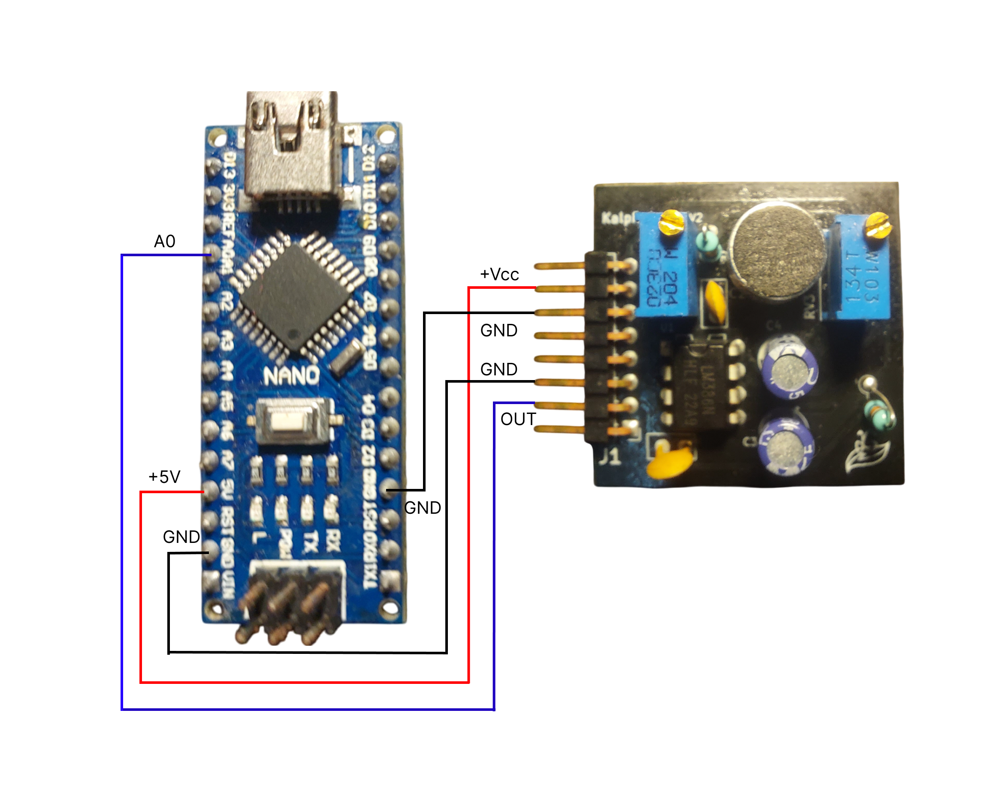

# Getting Started

## What You'll Need

Before starting with your Kaush Sound Sensor v1.0, ensure you have all the required components and software ready.

### Hardware Requirements


**Essential Components:**

1. ✅Kaush Sound Sensor v1.0  
2. ✅Microcontroller (Arduino Nano, ESP32, or Raspberry Pi)  
3. ✅USB cable (for programming the microcontroller)  
4. ✅Jumper wires (male-to-female recommended)  
5. ✅Breadboard (optional, but highly recommended for prototyping)  
6. ✅Power supply (4V–12V) or USB power  

**Optional Components:**

1. 🔧Multimeter → For verifying voltage and connections  
2. 🔧Audio source (speaker, phone, or buzzer) → For testing sound detection 

### Software Requirements

**For Microcontroller Programming:**

1. Arduino IDE (v1.8.0 or later)
2. USB drivers for your microcontroller
3. Kaush Sound Sensor library (provided)


## Step-by-Step Setup


### Step 1: Choose Your Platform

Select your preferred microcontroller platform. Each has its advantages:

#### Option A: Arduino Nano (Recommended for Beginners)

*Complete Arduino Nano setup with Kaush Sound Sensor*

**Advantages:**
- Easy to program with Arduino IDE
- 5V operation matches sensor well
- Large community support
- Real-time sampling up to 4kHz

#### Option B: ESP32 (WiFi Enabled)

*ESP32 setup enabling wireless data transmission*

**Advantages:**
- Built-in WiFi for wireless data
- Higher processing power
- IoT integration capabilities
- Web-based control possible

#### Option C: Raspberry Pi (Advanced Features)

*Raspberry Pi setup for advanced signal processing*

**Advantages:**
- Linux-based advanced processing
- Multiple communication interfaces
- Can run desktop application directly
- Real-time DSP capabilities

### Step 3: Basic Wiring (Arduino Nano Example)


**Connection Table:**

| Kaush Sensor Pin | Arduino Nano Pin |  Function           |
|------------------|------------------| --------------------|
| VCC              | 5V               |  Power Supply       |
| GND              | GND              |  Ground             |
| FILTERED_OUT     | A0               |  Analog Signal      |


### Step 4: Power Supply Connection


*Different power supply methods for the sensor*

**Power Options:**

#### USB Power (5V) - Simplest Method
```
Arduino Nano USB → Computer USB Port
Sensor VCC → Arduino 5V Pin
Sensor GND → Arduino GND Pin
```

#### External Power (6V-12V) - Maximum Performance
```
External Supply → Arduino VIN Pin
Sensor VCC → Arduino 5V Pin (regulated)
Sensor GND → Arduino GND Pin
```

#### Battery Power (Portable Operation)
```
4x AA Batteries (6V) → Arduino VIN Pin
Or 9V Battery → Arduino VIN Pin
```

### Step 5: Software Installation

#### Download Required Software

**Arduino IDE Setup:**

1. Download Arduino IDE from [arduino.cc](https://www.arduino.cc/en/software)
2. Install USB drivers for your microcontroller
3. Download Kaush Sound Sensor library from our [GitHub](https://github.com/Edge-Neuron)


#### Library Installation


**Method 1: Arduino IDE Library Manager**
1. Open Arduino IDE
2. Go to `Sketch → Include Library → Manage Libraries`
3. Search for "Kaush Sound Sensor"
4. Click Install

**Method 2: Manual Installation**
1. Download library ZIP from GitHub
2. Go to `Sketch → Include Library → Add .ZIP Library`
3. Select downloaded ZIP file
4. Verify installation in `Examples → Kaush Sound Sensor`

### Step 6: Upload Test Code


*Uploading test code to Arduino Nano*

**Basic Test Code:**
1. Open Arduino IDE
2. Go to `File → Examples → Kaush Sound Sensor → BasicTest`
3. Select correct board: `Tools → Board → Arduino Nano`
4. Select correct port: `Tools → Port → COM_X`
5. Click Upload button


### Step 7: Initial Calibration


**Calibration Procedure:**

#### 8.1 Baseline Setting

1. **Environment**: Start in quiet environment
2. **200K Pot**: Turn clockwise until you see waveform on the Kaush Software (12 o'clock)
3. **10K Pot**: Once 200k pot is successfully calibrated, you can turn this clock-wise to increase the gain and anticlock-wise to decrease the gain
4. **Monitor**: Watch serial output for baseline ~VCC/2

#### 8.2 Sensitivity Adjustment

1. **Test Sound**: Speak normally at 30cm distance
2. **200K Pot**: Slowly increase until clear signal appears
3. **Fine-tuning**: Adjust 10K Pot for desired amplitude (1-2V peak)
4. **Verification**: Test at different distances

#### 8.3 Optimal Settings
```
Quiet Environment:

- Expected Output: 1.5V baseline, 2-3V with speech

Noisy Environment:

- Expected Output: Reduced baseline, clear speech signals
```


## Quick Start Video Tutorial

!!! video "Complete Setup Guide"
    Watch our comprehensive setup tutorial covering all steps:

[](https://youtube.com/watch?v=YOUR_GETTING_STARTED_VIDEO_ID)

## Potential First-Time Issues

### Issue 1: No Serial Output
**Symptoms:** Arduino IDE serial monitor shows no data
**Solutions:**

1. Verify COM port selection
2. Check baud rate (115200)
3. Ensure USB cable supports data (not charge-only)
4. Try different USB port
5. Calibrate Sensor Again
6. Reconnect supply or try different Power Supply
7. Push the reset/restart button of microcontroller(ESP32 or Arduino)

### Issue 2: Constant High/Low Readings
**Symptoms:** Sensor output stuck at 0V or VCC
**Solutions:**

1. Check power supply voltage (4-12V range)
2. Verify wiring connections
3. Adjust 200K potentiometer
4. Test with multimeter
5. Check whether GND and VCC are swapped accidentally

### Issue 3: No Response to Sound
**Symptoms:** Output doesn't change with audio input
**Solutions:**

1. Increase 10K potentiometer (gain)
2. Verify microphone is not blocked
3. Test with louder sounds first
4. Check pre-amp output (A2 pin)
5. Clean the bottom side of sensor 

### Issue 4: Desktop App Won't Connect
**Symptoms:** Cannot establish COM port connection
**Solutions:**

1. Install Arduino USB drivers
2. Close Arduino IDE serial monitor
3. Check Windows Device Manager
4. Check Arduino

## Success Indicators

When your setup is working correctly, you should see:

- 🟢 **Stable baseline** around VCC/2 in quiet conditions
- 🟢 **Clear waveforms** when speaking at normal volume
- 🟢 **Responsive adjustments** when turning potentiometers
- 🟢 **Real-time display** in desktop application
- 🟢 **Meaningful FFT data** showing voice frequencies

## Next Steps

Congratulations on completing the basic setup! You're now ready to:

1. **[Explore Pin Configuration](pin-config.md)** - Learn about advanced wiring options


---

## Need Help?

- 📺 **Video Tutorials**: [Edge Neuron YouTube Channel](https://www.youtube.com/@EdgeNeuron)
- 💻 **Code Repository**: [GitHub - Edge-Neuron](https://github.com/Edge-Neuron)
- 🔧 **Troubleshooting**: [Common Issues Guide](troubleshooting.md)

---

*Ready to dive deeper? Continue to [Pin Configuration](pin-config.md) for advanced connection options.*