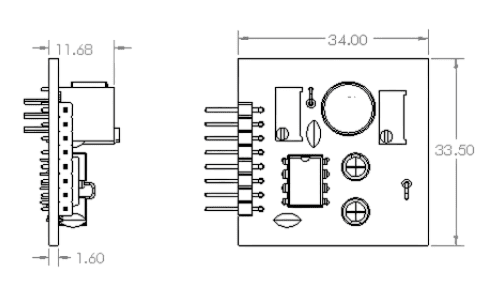
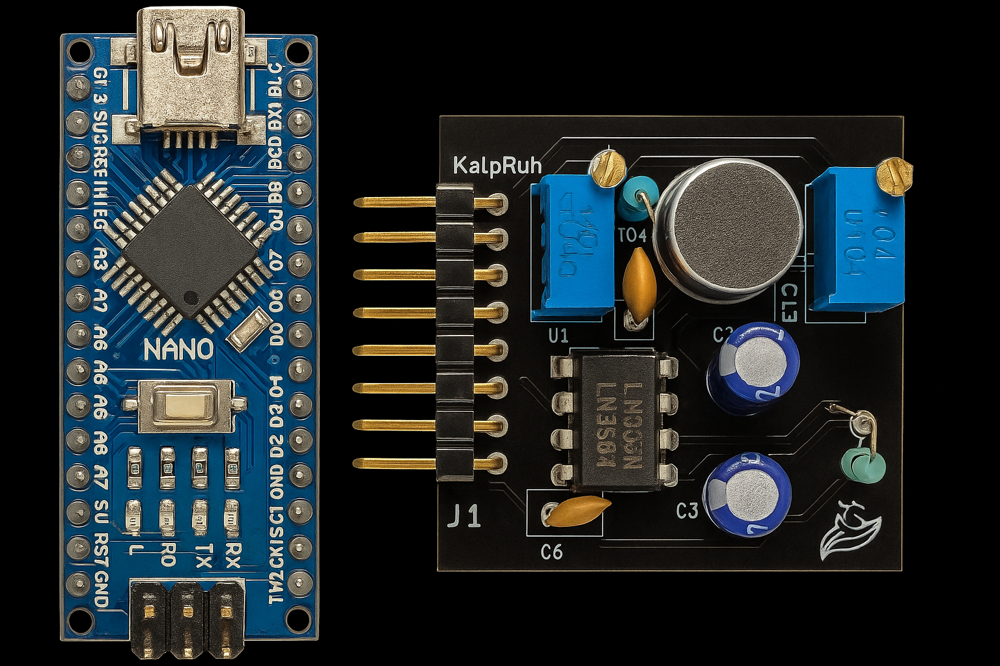
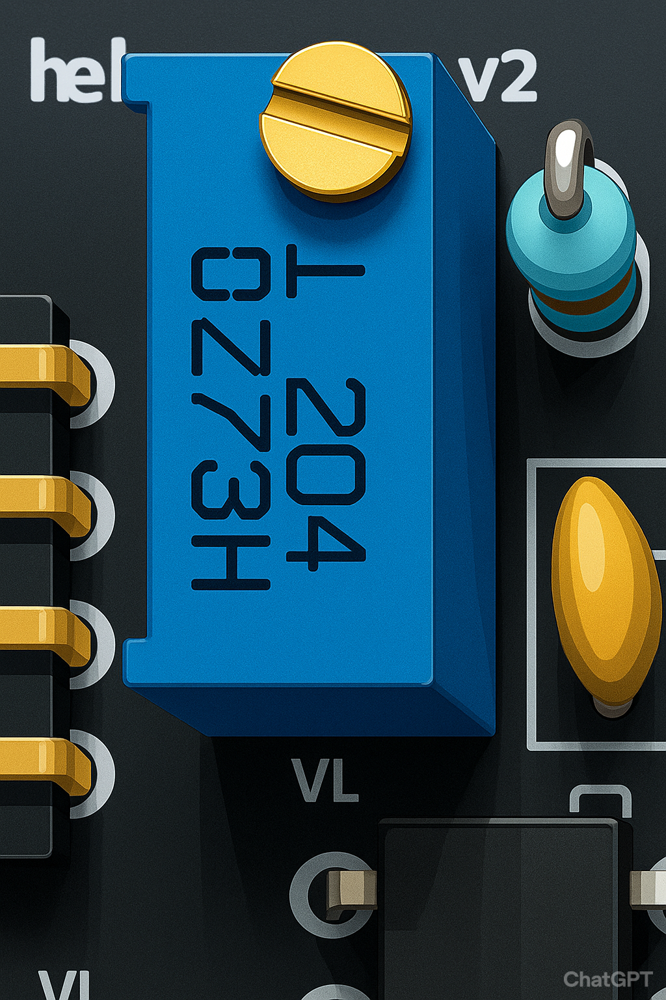
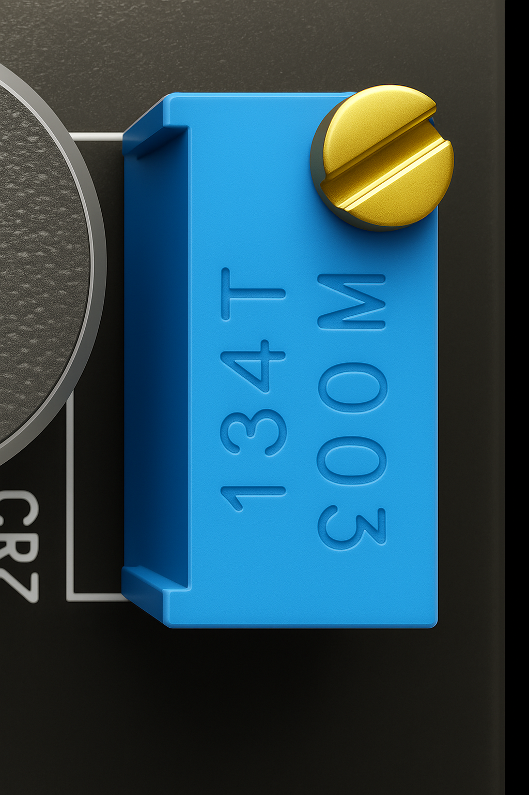
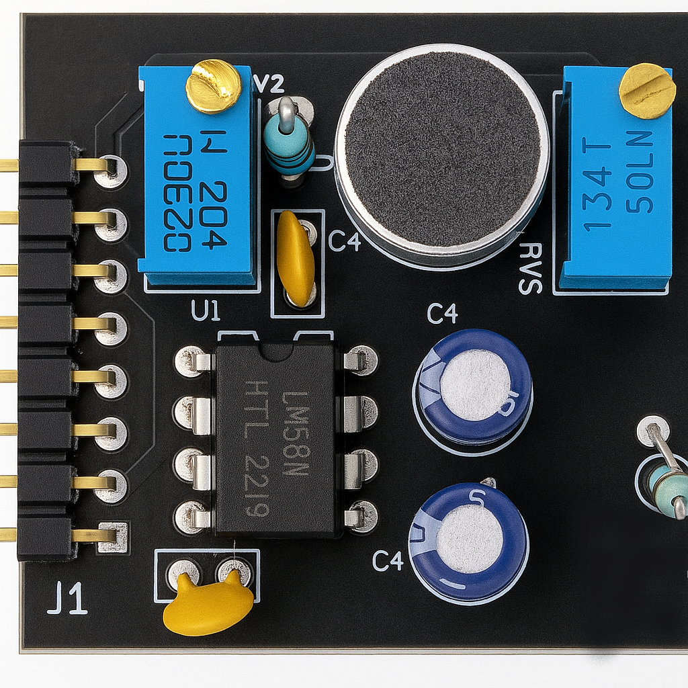
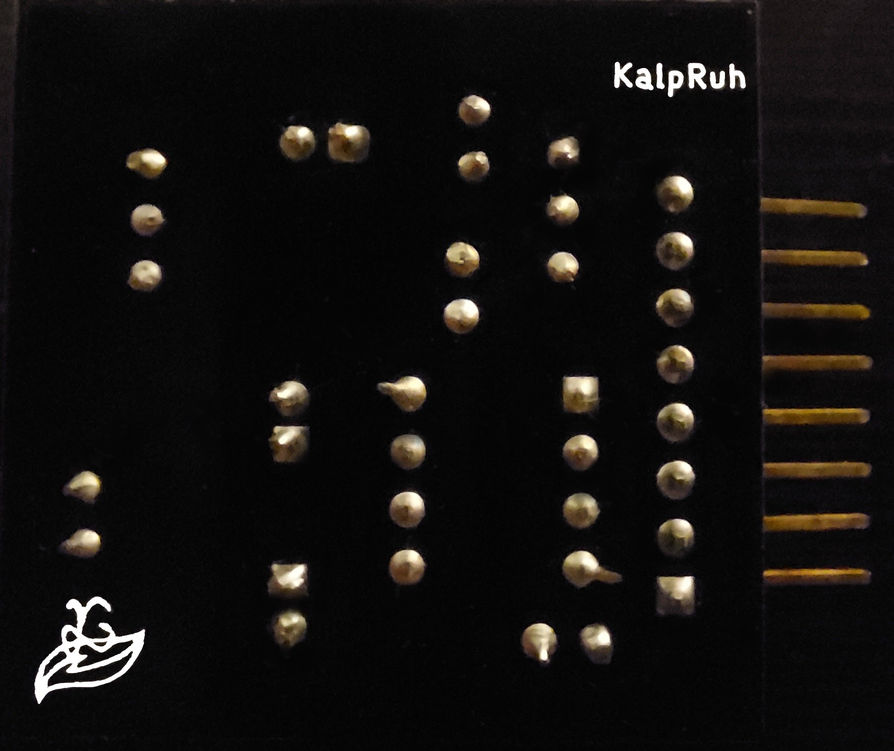
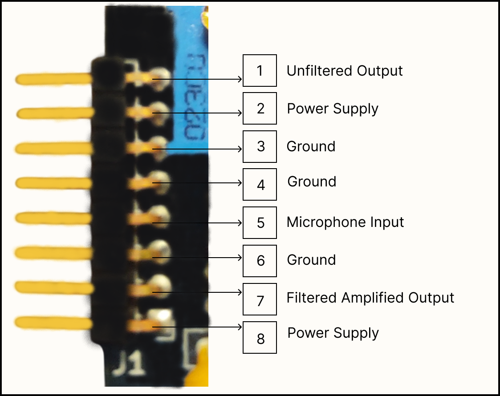
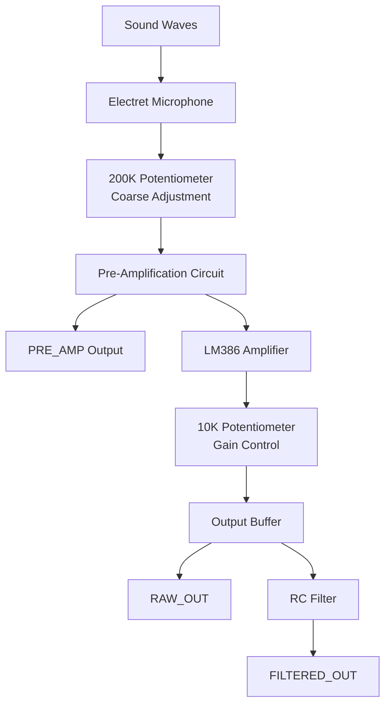

# Hardware Specifications

## PCB Overview

The Kaush Sound Sensor v1.0 is built on a compact, professionally designed PCB that integrates all necessary components for high-quality audio signal processing.

## Physical Dimensions

{.large}

*Note that all dimensions are in mm*

### Size Specifications
- **Length**: [Insert measurement] mm
- **Width**: [Insert measurement] mm  
- **Height**: [Insert measurement] mm (including components)
- **Weight**: [Insert weight] grams
- **PCB Thickness**: 1.6mm (standard)

### Size Comparison
{.small}  

*Kaush Sound Sensor compared to Arduino Nano*

## Component Breakdown

### Primary Components

#### 1. LM386 Audio Amplifier IC
- **Function**: Low voltage audio power amplifier
- **Gain Range**: 20x to 200x (adjustable)
- **Supply Voltage**: 4V to 12V
- **Output Power**: Up to 325mW
- **Features**: 
  - Low quiescent current (4mA)
  - Wide supply voltage range
  - High input impedance
  - Excellent signal-to-noise ratio

#### 2. Electret Microphone
- **Type**: Omnidirectional electret condenser microphone
- **Frequency Response**: Optimized for human voice (300Hz - 3.4kHz)
- **Sensitivity**: High sensitivity for distant sound detection
- **Power Requirements**: Low power consumption
- **Mounting**: PCB surface mount

#### 3. Dual Potentiometer System

##### Coarse Adjustment (200K Potentiometer)
{.super_small}

- **Value**: 200kΩ
- **Function**: Pre-amplification signal adjustment
- **Location**: Near microphone input
- **Adjustment Range**: Input signal attenuation/boost
- **Usage**: Set baseline sensitivity level

##### Fine Gain Control (10K Potentiometer) 
{.super_small}

- **Value**: 10kΩ  
- **Function**: LM386 gain adjustment
- **Gain Range**: 20x to 200x amplification
- **Location**: Connected to LM386 gain pins
- **Usage**: Fine-tune output amplitude

#### 4. Signal Conditioning Circuit
- **Input Filtering**: High-pass filter for noise reduction
- **Output Filtering**: RC low-pass filter option
- **Coupling Capacitors**: DC blocking for clean signal transfer
- **Bias Network**: Proper DC biasing for optimal performance

## PCB Layout Analysis

### Front Side (Component Side)
{.small}

*Front side showing component placement*

**Key Features:**
- Optimized component placement for minimal noise
- Short signal paths for better performance
- Ground plane for EMI shielding
- Clear component labeling

### Back Side (Solder Side)
{.small}

*Back side showing traces and ground plane*

**Key Features:**
- Continuous ground plane
- Minimal via usage
- Clean trace routing
- Proper isolation between analog and digital sections

## Pin Configuration

{.small}

*Detailed pin configuration with labels*

### Power Pins
- **VCC**: Positive power supply (4V - 12V)
- **GND**: Ground reference (0V)

### Signal Output Pins
- **FILTERED_OUT**: RC filtered analog output
- **RAW_OUT**: Unfiltered analog output  
- **PRE_AMP**: Signal before LM386 amplification

### Pin Specifications Table

| Pin Name | Type | Voltage Range | Function | Notes |
|----------|------|---------------|----------|-------|
| VCC | Power | 4V - 12V | Positive supply | Current: ~10mA typical |
| GND | Power | 0V | Ground reference | Connect to system ground |
| FILTERED_OUT | Analog Output | 0V - VCC | RC filtered signal | Recommended for most applications |
| RAW_OUT | Analog Output | 0V - VCC | Unfiltered signal | Maximum bandwidth |
| PRE_AMP | Analog Output | 0V - VCC | Pre-amplification signal | Lower amplitude |

## Power Supply Requirements

{.medium}

*Proper power supply connection methods*

### Voltage Specifications
- **Operating Range**: 4V to 12V DC
- **Recommended**: 5V (USB) or 9V (battery)
- **Current Consumption**: 
  - Quiescent: 4mA
  - Peak: 15mA (during loud signals)
- **Ripple**: <100mV peak-to-peak recommended

### Power Supply Options
1. **USB Power (5V)**: Direct connection from USB port
2. **Battery Power**: 4x AA (6V) or 9V battery
3. **Wall Adapter**: Regulated DC adapter (6V-12V)
4. **Microcontroller Supply**: Share power with Arduino/ESP8266

## Signal Flow Diagram

## Signal Characteristics

### Output Signal Properties
- **Baseline**: VCC/2 (Half supply voltage)
- **Peak-to-Peak Amplitude**: 
  - Close range (<10cm): Up to 3V
  - Medium range (10-30cm): 1.5-2V  
  - Long range (>30cm): 0.5-1.5V
- **Frequency Response**: 20Hz - 20kHz
- **Signal-to-Noise Ratio**: >60dB

### Waveform Characteristics
{.large}

*Typical output waveform showing baseline and amplitude*

## Adjustment Guide

### Initial Setup Procedure
1. **Power Connection**: Apply 5V-9V to VCC/GND
2. **Coarse Adjustment**: Set 200K pot to middle position
3. **Fine Adjustment**: Set 10K pot to minimum gain
4. **Testing**: Gradually increase gain while monitoring output
5. **Optimization**: Adjust both pots for desired sensitivity

### Optimization Tips
- **For distant sounds**: Increase both potentiometers
- **For close sounds**: Reduce gain to prevent saturation
- **For noisy environments**: Use filtered output
- **For maximum response**: Use raw output

## Environmental Specifications

### Operating Conditions
- **Temperature**: -10°C to +70°C
- **Humidity**: 0% to 95% (non-condensing)
- **Storage Temperature**: -40°C to +85°C

### Mechanical Properties
- **Vibration Resistance**: Good (solid PCB mounting)
- **Shock Resistance**: Standard electronic component levels
- **Connector Type**: Standard 0.1" pitch headers

## Quality & Compliance

### Manufacturing Standards
- **PCB Standard**: IPC-A-610 Class 2
- **Component Quality**: Industrial grade
- **Testing**: 100% functional testing
- **RoHS Compliance**: Lead-free manufacturing

---

## Next Steps

Now that you understand the hardware specifications, let's move on to:
- **[Getting Started Guide](getting-started.md)** - Step-by-step setup
- **[Pin Configuration Details](pin-config.md)** - Wiring diagrams

---

*Need help with hardware setup? Check our [video tutorials](https://www.youtube.com/@EdgeNeuron) or visit the [troubleshooting section](troubleshooting.md).*