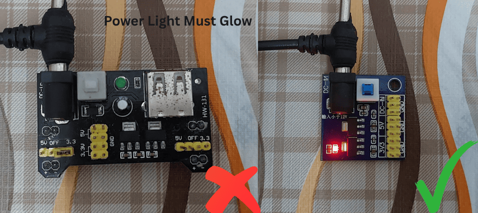
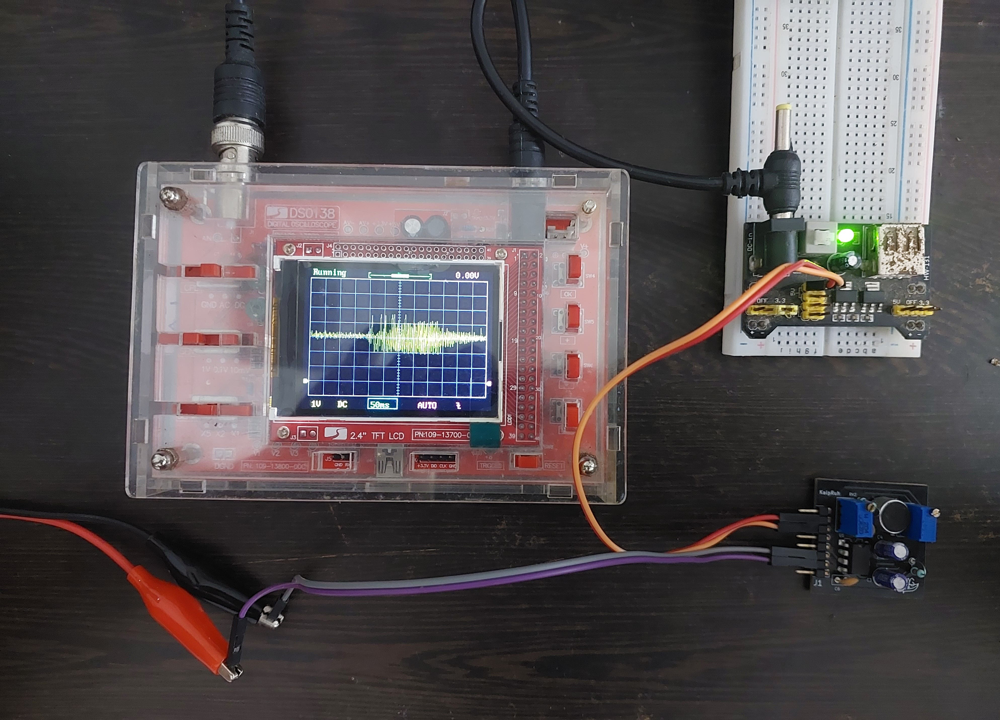

# Troubleshooting Guide

## Quick Diagnostic Tools

Before diving into specific issues, use these quick diagnostic methods to identify the problem category.


## Hardware Issues

### Power Supply Problems


*Common power supply problems and solutions*

#### Issue: No Response from Sensor

**Symptoms:**


- No serial output from microcontroller
- Sensor readings always 0V or VCC
- Potentiometers have no effect

**Diagnostic Steps:**


1. **Voltage Measurement**: Use multimeter to check VCC pin
2. **Ground Continuity**: Verify ground connections
3. **Current Draw**: Measure total current (should be 4-15mA)

**Common Causes & Solutions:**

| Cause | Symptoms | Solution |
|-------|----------|----------|
| **No Power** | 0V at VCC pin | Check power connections |
| **Reverse Polarity** | No current draw | Check VCC/GND polarity |
| **Insufficient Voltage** | Erratic behavior | Ensure 4V+ supply |
| **Poor Connections** | Intermittent operation | Re-solder connections |
| **Overloaded Supply** | Voltage drops under load | Use higher capacity supply |

#### Issue: Noisy or Unstable Readings

**Symptoms:**
- Random fluctuations in quiet conditions
- Baseline drift over time
- Interference patterns in signal

**Solutions:**

1. **Add Power Filtering:**
```cpp
// Hardware solution: Add capacitors near sensor
// 100µF electrolytic + 0.1µF ceramic in parallel
// Connect between VCC and GND as close to sensor as possible
```

2. **Software Filtering:**
```cpp
// Moving average filter for noisy readings
class MovingAverage {
private:
  float buffer[16];
  int index = 0;
  bool filled = false;
  
public:
  float update(float value) {
    buffer[index] = value;
    index = (index + 1) % 16;
    if (index == 0) filled = true;
    
    float sum = 0;
    int count = filled ? 16 : index;
    for (int i = 0; i < count; i++) {
      sum += buffer[i];
    }
    return sum / count;
  }
};

MovingAverage filter;
float filteredReading = filter.update(sensor.readSample(uint8_t channelIndex));
```


### Connection Problems

#### Issue: Intermittent Operation

**Symptoms:**
- Sensor works sometimes, fails other times
- Connection-dependent behavior
- Data corruption or missing samples

**Diagnostic Process:**


*Testing connections with multimeter and oscilloscope*

1. **Continuity Testing:**
```cpp
void testConnections() {
  Serial.println("Connection Test - Wiggle wires during test");
  
  for (int i = 0; i < 100; i++) {
    float reading = sensor.readSample(uint8_t channelIndex);
    
    // Check for sudden jumps (bad connection indicator)
    static float lastReading = reading;
    float change = abs(reading - lastReading);
    
    if (change > 0.5) { // Large sudden change
      Serial.print("ALERT: Large change detected at sample ");
      Serial.print(i);
      Serial.print(" - Change: ");
      Serial.println(change);
    }
    
    lastReading = reading;
    delay(50);
  }
}
```

2. **Wire Quality Assessment:**
```cpp
void assessWireQuality() {
  Serial.println("Wire Quality Assessment:");
  
  // Take many rapid readings
  float readings[1000];
  unsigned long startTime = micros();
  
  for (int i = 0; i < 1000; i++) {
    readings[i] = sensor.readSample(uint8_t channelIndex);
    delayMicroseconds(500); // 2kHz sampling
  }
  
  unsigned long endTime = micros();
  
  // Check for missing or corrupted samples
  int anomalies = 0;
  for (int i = 1; i < 1000; i++) {
    float change = abs(readings[i] - readings[i-1]);
    if (change > 1.0) { // Impossibly large change
      anomalies++;
    }
  }
  
  Serial.print("Sampling rate: ");
  Serial.print(1000000.0 / ((endTime - startTime) / 1000.0));
  Serial.println(" Hz");
  
  Serial.print("Anomalies detected: ");
  Serial.print(anomalies);
  Serial.println(" / 1000");
  
  if (anomalies < 5) {
    Serial.println("Wire quality: GOOD");
  } else if (anomalies < 20) {
    Serial.println("Wire quality: FAIR - Consider replacement");
  } else {
    Serial.println("Wire quality: POOR - Replace immediately");
  }
}
```

**Connection Quality Solutions:**

1. **Use Quality Connectors:**
   - Gold-plated pins prevent corrosion
   - Secure mechanical connection
   - Proper strain relief

2. **Cable Management:**
   - Keep analog cables short (<50cm)
   - Route away from switching power supplies
   - Use twisted pair for long runs
   - Shield cables in high-noise environments

3. **Soldering Best Practices:**
   - Use rosin-core solder
   - Clean connections with isopropyl alcohol
   - Proper tinning of wires
   - Heat shrink tubing for insulation

### Component Issues


#### Issue: Microphone Problems

**Symptoms:**


- Very low sensitivity
- Distorted audio at normal levels
- Frequency response issues
- Physical damage visible


## Support Resources and Community Help

### Getting Additional Help

#### Official Support Channels

**GitHub Issues Tracker**
   - Report bugs and technical issues
   - Request new features
   - Access community solutions
   - Link: [https://github.com/Edge-Neuron/issues](https://github.com/Edge-Neuron/issues)

**YouTube Channel - Edge Neuron**
   - Video tutorials and troubleshooting guides
   - Live Q&A sessions
   - Project demonstrations
   - Link: [Edge Neuron YouTube](https://www.youtube.com/@EdgeNeuron)

**Documentation Updates**
   - Latest troubleshooting guides
   - Known issues and workarounds
   - Software updates and patches

#### Community Resources

**Email Support**
   - Direct technical support for critical issues
   - Commercial/educational inquiries
   - Partnership opportunities


#### Best Practices Summary

##### Installation
   1. Follow wiring diagrams exactly
   2. Use quality connections
   3. Provide clean, stable power
   4. Allow proper ventilation

##### Operation
   1. Regular calibration
   2. Monitor environmental conditions
   3. Keep firmware updated
   4. Document any unusual behavior

##### Storage
   1. Anti-static packaging
   2. Controlled temperature/humidity
   3. Avoid mechanical shock
   4. Periodic testing if stored long-term

---

## Quick Reference Emergency Procedures

### Emergency Diagnostic Checklist


1. ✅ **Power**: Check voltage at sensor VCC pin
2. ✅ **Ground**: Verify continuity to microcontroller ground
3. ✅ **Connections**: Wiggle test all wires
4. ✅ **Software**: Upload basic test sketch
5. ✅ **Environment**: Test in different location
6. ✅ **Hardware**: Try different microcontroller
7. ✅ **Baseline**: Check if readings make basic sense
8. ✅ **Documentation**: Compare with working examples


---

**Remember**: Most issues are simple connection or configuration problems. Start with the basics before assuming hardware failure. The Kaush Sound Sensor community is here to help!

## Final Documentation Summary

🎉 **Congratulations!** You now have a complete, comprehensive documentation suite for the Kaush Sound Sensor v1.0, including:


✅ **Introduction & Overview** - Project introduction and key features
✅ **Hardware Specifications** - Complete component analysis and PCB details
✅ **Getting Started Guide** - Step-by-step setup for beginners
✅ **Pin Configuration** - Detailed wiring for Arduino, ESP8266, and Raspberry Pi
✅ **Troubleshooting Guide** - Comprehensive problem-solving resource

This documentation provides everything needed for users to successfully implement, troubleshoot, and create amazing projects with your Kaush Sound Sensor v1.0!